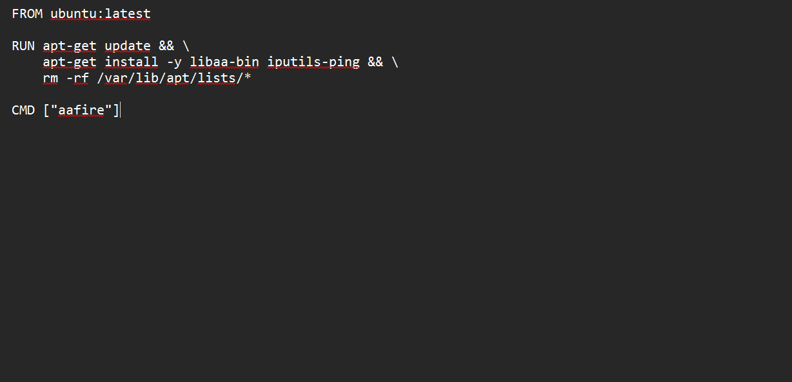
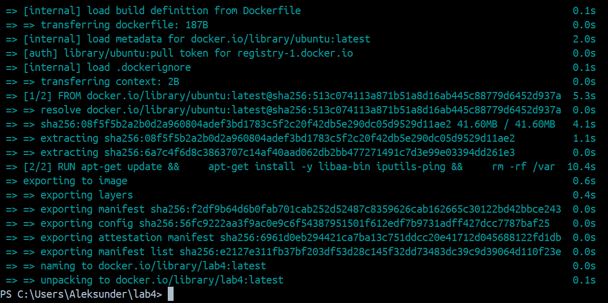
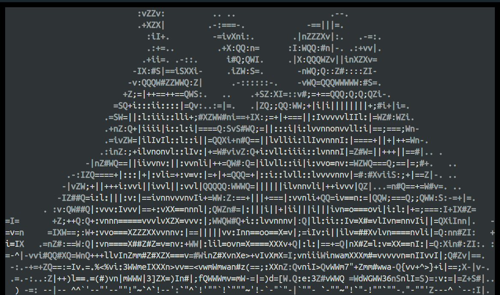
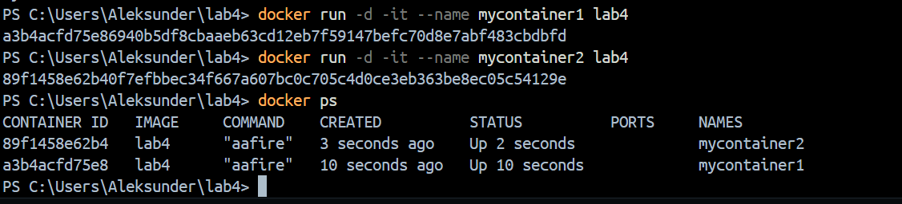
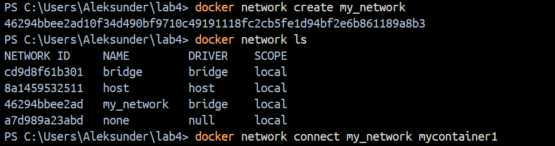
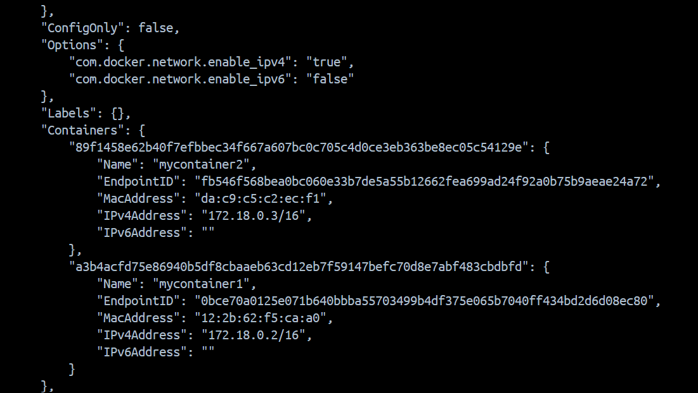
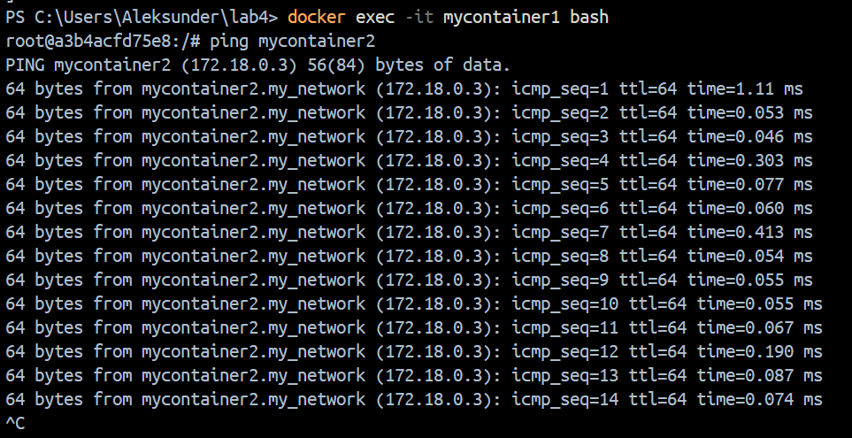

# Лабораторная 4

## Выполнение

Был создан Docker-образ на основе Ubuntu с установленными aafire и ping.

Соберём его.

Запустим.

Далее создадим пользовательскую сеть my_network и подключим к ней два контейнера.

Теперь проверим доступ из одного в другой контейнер командой ping.

Все работает, лабораторная выполнена.
